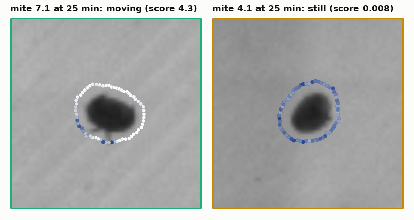

# Varroa detector for the Discobox: user manual

*Agroscope · status of 17 November 2026 · part 1 of 3*

*This part explains how to use the app. Part 2 (`2_how_it_works.md`) explains what it
computes, with each step run on one real mite, and part 3 (`3_performance.md`) shows how
well it works.*

The app watches varroa mites glued on plates inside the Discobox. It detects the mites on
the first frame, decides in every short recording whether each mite moved, and generates
survival curves per treatment group. It can run a test from start to finish on the
Discobox camera (**Live**), analyse recordings made earlier (**Analysis**), and check its
own calls against what you see by eye (**Calibration**).

**The motion detection threshold matters most.** Every call depends on it. Section 4 explains when and how
to set it, and how to check it.

---

## 1. Installing, starting and stopping

### 1.1 First installation

**On the Discobox PC (Linux)**, for live runs:

1. Install Vimba X (the camera's driver) as the Discobox readme describes. The original (Abilium)
   Discobox app's setup uses the same installation.
2. Get the Varroapp and install it, giving the path of the Vimba X SDK (the same path as for
   the Discobox app's `setup-python-env.sh`):

   ```bash
   git clone https://github.com/Mateo-Schaerer-Gonzalez/Varroa_detector_discobox ~/Varroa_detector_discobox
   cd ~/Varroa_detector_discobox
   bash install_linux.sh ../VimbaX_Setup-2025-1-Linux64     # your Vimba X SDK folder
   ```

   This installs conda (Miniforge) if it is missing, creates the Python environment
   `discobox_env` and adds a *Varroa discobox* icon to the desktop and the app menu.
3. Allow your user to set up the fan and LED parameters, then log out and in again (note on the discobox if reusing the VimbaX setup from original software this isn't needed):

   ```bash
   sudo adduser $USER dialout
   ```

Without the Vimba X path (`bash install_linux.sh`) the app installs for analysis only.

**On Windows** (analysis and calibration only, no camera): install
[Miniforge](https://github.com/conda-forge/miniforge), then in its prompt

```bash
git clone https://github.com/Mateo-Schaerer-Gonzalez/Varroa_detector_discobox
cd Varroa_detector_discobox
conda env create -f discobox_env.yaml
```

### 1.2 Starting

| Where | How to start | Address |
|---|---|---|
| Discobox PC (Linux) | Desktop icon *Varroa discobox* | http://127.0.0.1:8010 |
| Windows | Double-click `start.bat` | http://127.0.0.1:8000 |

The browser opens by itself. On the PC connected to the Discobox, the icon first fetches the newest version of
the app (if the PC is online) and restarts the server, except while a live test is
running. Everything runs on the PC itself: no internet is needed, except for the optional text recognition tool that reads the labels on the glass microscope slides automatically (section 2.2).

### 1.3 Stopping

Close every tab of the app; the server stops about 10 s later. A running live test keeps
it going until the test ends. On Linux you can also right-click the icon and choose *Stop
the app*.

---

## 2. Starting a run on the Discobox (Live)

The screenshots of this section were taken on a simulated Discobox: its camera plays the
recordings of a 2025 test session, so it is called *Demo camera*.

### 2.1 Connect


1. Name your run and click **Connect**. The camera and the Discobox's Arduino (fan and
   LEDs) are found automatically, both LED strips are turned on, and the camera image appears.

   

2. Check the **settings**. They can be changed until the run starts:

   | Setting | Meaning |
   |---|---|
   | Time between recordings | Minutes from the start of one recording to the start of the next, as in the Discobox Abilium app. The fan, the LEDs and the recording itself (about 11 s together) fall within it |
   | Fan / LED durations and intensities | As in the Discobox Abilium app. *On/Off* tests the fan; the sliders set intensities |
   | Experiment duration, at most | The longest duration of a run. It stops earlier once every mite is dead (section 2.3), unless *Stop once every mite is dead* is unticked |
   | Dead when still for | How long, in minutes, a mite must stay still to count as dead (the death time). Required. This time is added to the end of the run so a dead mite can be told apart from a mite that is only still for a while |
   | Stop once every mite is dead | Ticked by default: the run ends once every mite is dead, and dead mites are no longer recorded. Untick it to record for the whole experiment duration: every recording of every mite is then saved, dead mites too. This takes more storage |
   | Most a mite moves between recordings | How far a mite is followed from one recording to the next (50 px by default, 0 = not at all). A mite is about 20 px wide |
   | Recording length | How long each recording lasts, in seconds (3 s by default) |
   | Frame rate | Frames per second of each recording (30 fps by default, at most 33, the camera's limit) |
   | Save the recordings | Keep each mite's video. Needed to replay, label ground truth or re-analyse. Untick if you are only testing the run and don't need to keep the data |

   Every recording is **3 s at 30 fps** (90 frames) by default. Keep these unless you have a
   reason to change them: the threshold only fits recordings of the length and frame rate it
   was calibrated on, so after changing either, calibrate the threshold again (section 4). The
   note under the settings says so too.

3. If the status text under *Connect* turns red or grey, read it: it says what failed
   (camera not found, serial port refused, …).

### 2.2 Label the slides and start

Click **Next: label the slides**.

1. Check the **Zone mask**, which says where the slides and their label areas are:
   - **Found on the first frame (automatic)**, the default: the app finds each slide in use
     from its frosted end, and the label area on it.
   - **One zone per slide** or **Two zones per slide** (upper and lower half): fixed zones
     for the usual positions of the slides. Choose *One zone per slide* if the automatic
     mask misses a slide.
   - A mask you drew yourself on the **Zones** page (section 3.9), e.g. for slides placed
     differently.
2. If the PC is online you can tick **Read labels from glass slides** to fill in every
   slide's label automatically (see the note below). Otherwise click a slide and type its
   label. <kbd>Tab</kbd> saves and goes to the next slide. If you use negative controls, tick
   **negative control** under the control slides: every other group is compared with them using a log-rank test.
   A slide with mites that you leave without a label is listed as **unlabelled slide**, and
   its mites are analysed as a group of their own.
3. Each detected mite is encircled by a green ring. Click a ring that is not a mite (dust, a shadow) to cross
   it (this removes it from the analysis). To add a mite the detector missed, click **Place a mite by hand**, then click the mite
   (section 3.3).
4. Click **Start test run**. The LEDs turn off, and from then on the Varroapp switches on the fan and
   LEDs before each recording.


In the picture, slide 7 is being named (the box on the right) and is ticked as negative
control. The red crossed ring at the top right of slide 7 sat on the support plate, not on a
mite, and was clicked away. Slide 16 has no label, so it is listed as *unlabelled slide*.

**Note on *Read labels from glass slides*.** This option (off by default) sends a picture
of each hand-written label to Google Gemini and fills in the names for you to check. It
needs an internet connection and a free API key (aistudio.google.com/apikey) saved as
`GEMINI_API_KEY=...` in a file `.env` in the app's folder. The developer's key is preset,
so it works out of the box; to use your own, paste your key there instead.

### 2.3 During the run

The results pages fill in after every recording so that the output is updated in real time. A panel at the top of the page shows:


- **A circle per zone**, filling as its mites die; the numbers under it are the dead mites
  out of those seen moving. A zone whose mites have not been seen moving yet is drawn hollow
  (with a dash under it) and doesn't count, so it doesn't hold up the end of the run. When every counting zone is done, the run stops by itself and
  the panel says why, unless *Stop once every mite is dead* was unticked (section 2.1): the run then goes on
  for its whole duration, and every mite keeps being recorded, dead ones too (more storage).
- The camera's frame rate and any dropped frames (shown in red if there are any: frames
  the camera sent faster than the PC could take them in, which are left out of the
  recording); whether
  the fan, LED 1 and LED 2 are on or off at that moment (they come on before each recording
  for their durations, and are off in between; *No fan/LED controller* means the Arduino was
  not found and the run goes on without them); and the countdown to the next recording.

The panel also has buttons to **pause** and **stop** the run, **add mites** (put on slides after the start of the run; they are detected by the app between two recordings, and can be placed by hand before the next recording, section 2.4), enter **ground truth** (label the mites observed moving or still by eye, section 4.3) and
enter a **poke test** between recordings (section 2.5). Closing the browser does **not**
stop a run: open the page again to get back to it.

### 2.4 Add mites during the run

When clicking add mites between recordings the app will take you to the same page used to add mites at the start of the run.
The LEDs come on, and the mites not followed yet are detected on the camera's image and
ringed. Click a ring to leave that one out, or **Place a mite by hand** for one the detector
missed, then click **Add N mites** (or **Cancel**). The run waits meanwhile; this can't
be done when the next recording is about to start.


The mites added are followed from the next recording on, numbered after their zone's mites,
each on its own clock (section 3.4), and the panel says how many are waiting ("4 mites will be followed from the next recording on):


### 2.5 Enter a poke test

**Note: the poke test is not used to calibrate the threshold; run one only if it is of interest to you. If you do decide to run a poke test ensure that the slides are moved as little as possible between the pokes and align the support plate to the top right corner of the discobox each time it is placed in the box**

Poking a mite, e.g. approaching with the tip of a pencil (the static electricity should stimulate a live mite to move ahead of physical contact, pursue contact to confirm death) says whether it is alive: one that moves when poked was alive up to then, one
that doesn't is dead from then on. During a live run, just after the recording is finished, remove the slide you want to perform your poke test on, do your poke test, then put the slide back (make sure to align it the same way it was before you took it out). Then save the results of your poke test by clicking the **poke test** button. If you think the poke test will take longer than the interval between recordings, pause the run.

During a live run, open *Poke test* on the live panel
between two recordings, right after you poke; for recordings made earlier, click **Enter a
poke test** on the ground-truth page (section 4.3). Then:

1. **Add round** for each time you poked, saying after which recording.
2. Choose what a click marks (*moved*, *did not move*, *not poked*) and click each mite you
   poked.


The *Test* report (section 4.5) then draws survival by the pokes with the
detector's survival over it, as well as the outline change between recordings.

**Do the poke test outside the discobox**: First it isn't practical, second it could interfere with the next recording.

### 2.6 After the run


note: here the max recording time was too short. (this is why not all zone circles are filled)

The run is saved in `recordings/<run name>/` and listed with the previous recordings. Open
it in *Analysis* to see the results again, or in *Calibration* to manually label it. Re-analysing it
gives exactly the same scores as the live run because the algorithm is deterministic.

---

## 3. Analysing recordings made earlier (Analysis)

### 3.1 Open the recordings

In *Analysis*, either pick one of the previous recordings, or drag the session folder (e.g. the
one that holds the old Discobox recording folders) onto the page, or click *Choose folder*.
The images are copied into the app. Your own folder is not changed, and dropping the same
folder again only sends what changed.


In the list of previous recordings, **Analyse** and **Calibrate** are in the first column.
Settings shown in **red** differ from the live settings now (section 2.1): a threshold
calibrated with the settings now may not fit those recordings (section 4.1). In the picture,
the 2025 test sessions and the demo run were recorded at 1 s, while the live settings are
now 3 s.

The first time the folder is analysed or calibrated, the frames are shrunk to just the mites' surroundings, with the same results (part 3 shows how much space this saves). Until then
it keeps its whole frames, so before the first analysis is the moment to add any mite the detector missed
(section 3.3): afterwards there is nothing left to add the mites on, as only a mite's surroundings are saved.

> Don't open a folder by typing its path if you want to keep it untouched (this is important for old abilium recordings as these will be cut down to mite ROIs when analyzed). Labels and
> corrections are then saved next to its recordings.

### 3.2 Label glass slides

As in 2.2: check the zone mask, click a slide, type its label, <kbd>Tab</kbd> to the next,
tick the negative controls.

### 3.3 Place a mite the detector missed

Note: this section applies to recordings made with the old abilium software, for recordings made with the current software, adding mites in analysis mode isn't possible as the recording is already shrunk to the mite's surroundings. In the latter case ddding mites is handled in the live run (see section 2), so presumably all mite's should be included as the user had the chance to add any missing mites when the recording was originaly made.

Click **Place a mite by hand**, then click on the mites the automatic detection has missed. The ring goes on the dark spot
nearest the click (within 8 px), so the click need not be exact. A click off the slide, on
a slide's label, or within 10 px of another mite is refused. When you are done click **Done placing mites** to save the manually added mites.


note: the mite's added by hand here are not real mites, as no recording was available where mites were missed by the detector.


A mite placed by hand has a dashed blue ring (you can click the dashed ring again to take it away). The added mite is saved with the
recordings (`mites_by_hand.json`) and found with the detector's mites everywhere: in the
analysis, in calibration and in a live run. The button is not shown for a session already
shrunk to the mites' surroundings (a saved live run, or a dropped folder after its first
analysis).

### 3.4 Mites put on the slides after the start of a run

Mites put on after the first recording of a run are found too: the app looks at the first frame of
every subsequent recording, and detects mites again in a zone only when at least **Least new mites per zone** (on the label page, 3 by default, 0 to switch it off) are detected in the same recording. 

Each mite found this way is runs on its own clock from
the recording it appeared in. The label page shows them in yellow under *Added at recording
N*.


During a live run, add them with **Add mites** instead (section 2.4).

### 3.5 Read the results

The results come on three levels of page, each opened from the one above it:

| Page | Shows | Opened by | Section |
|---|---|---|---|
| **Overview** | the whole run: every group, zone and mite | finishing an analysis, or opening a run | 3.5.2 |
| **Zone page** | the mites of one zone | clicking a zone (on the slide map, a zone card or a chart) | 3.5.3 |
| **Mite page** | one mite in every recording | clicking a mite (on a zone page or a chart) | 3.5.4 |

The browser's back button goes back up. Every chart is interactive, opens what it shows when
clicked, and downloads as SVG or PNG.

Every recording shown (slide, zone, mite, ground truth) **plays once** and stops on its
last frame; **Play** plays it again. Tick **Loop** to play it over and over (the browser
remembers the choice). Loop is off by default because it can bias the reading of mite movement by eye.

Each part of a page is shown below under its title on screen. The screenshots are of
`sample_data`, a 2025 test session of 6 recordings over 25 minutes.

#### 3.5.1 Check the close calls by eye

A mite dies at the recording after its last movement, so a single wrong call can move its
death by hours. Under **To check by eye**, near the top of the overview, you choose how many mites to check (20 by
default, 0 for none). The app picks the scores closest to the threshold that a mite's time
of death depends on and asks about them one by one. It also asks about the peaks of a
mite's score below the threshold after its last movement: a weak last twitch often scores
below the motion detection threshold but stands out on the mite's score graph, where every recording to check
is ringed (circled). Click the recordings it suggests and label each as *Moving* or *Still*
(<kbd>M</kbd>, <kbd>S</kbd>).


The bar under *To check by eye* (section 3.5.2) fills as you answer.

#### 3.5.2 The overview page

From top to bottom, the overview holds:

- **Key figures and checks**: the key figures, *To check by eye*, the *Glass slide map*
- **Survival**: *Survival rate by group*, *Survival against the negative control*
- **Movement**: *Movement per zone*, *Group summary*, *Motion scores by group*, *Motion scores of moving mites by group*, *Rest between movements, per zone*
- **Plate stability**: *Plate shake*, *The 10 mites that drifted furthest*
- **Unusual activity**: the counts, *Fly-off tracks*, *Rotators*, *Recordings set aside*

##### Key figures and checks


**To check by eye**: the recordings to check, explained in section 3.5.1.


**Glass slide map**: the recording shown, with every mite ringed green (moving) or orange
(still) and each slide's label and how many of its mites move. Choose a recording with the
slider above it, or *Play*.


##### Survival

**Survival rate by group** (Fig. 2): the percent alive of each group over time, with its
95 % confidence band. *Dead when still for* above it changes the death time.


**Survival against the negative control**: each group's LT50 and the log-rank test against
the negative controls. This one is from the demo live run of section 2, whose control
slide's mites moved; in `sample_data` the control mites never moved, so there is nothing to
compare with.


##### Movement

**Movement per zone**: one small card per zone, the share of its mites moving in each
recording; the number is how many moved in the last recording. Click a card to open that
zone's page (section 3.5.3).


**Group summary**: per group, the number of mites detected, how often they moved, and the motion score mean, standard
deviation and median. *Moving* pools every mite in every recording: each mite in one recording counts once (a mite-recording), and *Moving* is the share of the group's mite-recordings called moving, after your corrections. For example, 10 mites over 50 recordings are 500 mite-recordings; if 120 were called moving, *Moving* is 24 %. Recordings after a mite died count as still, so the share falls the longer a run goes on and is not a survival rate. Recordings in which a mite is marked gone, or from before it was put on the slide, are left out; mites never seen moving are counted whether or not their tick is on. *Moving in last recording* is how many
mites moved in the final recording.


**Motion scores by group** (Fig. 3): every mite in every recording at its motion score, one
row per group; right of the dashed line is called moving.


**Motion scores of moving mites by group** (Fig. 4): a box plot of the scores of the recordings in which a mite moved, i.e. how strongly each group's mites move when they do.


**Rest between movements, per zone** (Fig. 5): the distribution of rest times per slide. Rest time is defined as the time between two recordings, where the mite is called by the motion detector (or user inputted correction) as moving.


##### Plate stability

**Plate shake** (Fig. 6): median plate shake over time, calculated by taking the median of all individual mite's centre drifts during a recording (see part 2 for more info).


The shake chart of a relatively still recording is usually under a tenth of a pixel
throughout. A recording or part of a run that shakes much more than the rest is worth checking
in the playback videos. Depending on the extent and timing of the excessive shaking it might be worth considering to redo the affected run instead of visually checking the motion detector calls

The upper chart is `sample_data`. The lower one is a 49-hour run: from about 1,230 min on,
its plate shook three to four times more in every recording than before (0.15 to 0.24 px
against about 0.05 px), possibly due to construction work nearby. The app moves each
mite's patch back by the shake before scoring it, so shake of this size changes few calls
(part 3, section 5.1). Still, where the line jumps, check a few recordings in the playback to be sure
(section 3.7), and correct the calls that are wrong (section 3.6).

**The 10 mites that drifted furthest** (Fig. 7): This figures shows the path of the mite's "centre of darkness" (see part 2 if you're interested in how this is calculated). Switching to path scale by clicking **Path** allows you to see the direction of the centre of darkness movement better. This can be helpful for diagnosing support plate wobble, if for example you see a lot of horisontal movement but not a lot of vertical movement.


##### Unusual activity

**Unusual activity**: fly-offs, rotators and recordings set aside. In `sample_data` there are
none; the pictures below are from the same 49-hour run, in which mite 6.9 came unglued and
walked off.


**Fly-off tracks**: the first frame with the track of every mite that flew off, from where it
was detected (its id, white dot) to where it was last followed, from light to dark. The
mites it disturbed are ringed in orange (their recordings are set aside), and the rotators are ringed in purple.
Only the part of the frame round the track is shown here.


**Rotators**: each mite whose body turned more than 30° where it is, and how far, in each
recording. This is purely an interesting phenomena noticed during testing the app but might be helpful to diagnose proper function of the adhesive tape. For example if you start seeing a lot more rotator mites, there might be an issue with the adhesive tape used as mites where able to wiggle in place.


**Recordings set aside**: A list of recordings set aside due to interference with a fly-away mite.


#### 3.5.3 A zone's page

Click a zone on the overview to see its mites. Its page has the same charts as the overview
for its mites alone: **Mites moving**, **Survival rate**, **Lifelines** (one line per mite,
from the first recording to its death, ×, or to the last recording, ○, if still alive; the
dots are the recordings in which it moved), **Motion score per mite** and the table of its
**Mites**. Click a mite to open its page (section 3.5.4).


#### 3.5.4 A mite's page

A mite's page shows its close-up video and its score in every recording: its **Close-up**, its **Motion score over time** and the table of its
**Recordings**:


A mite's close-up is **framed in the colour of its call**: green moving, orange still, grey
gone. The dots round the mite are darker where its outline changes more over the frames.



Note: the left mite is considered moving as the motion is concentrated around it's leg. On the right you see a still mite, whose motion is uniformly distributed around the body, this is mostly camera noise.

### 3.6 How Correct a call (outside the check by eye page)

On a mite's page, click the mite in the recording shown (or the recording's button in the
table) to switch its call between *moving* and *still*. Everything is recalculated accordingly and
the frame round the close-up turns **dashed** to indicate the manual change. Clicking again restores the detector's call.
In the table's last column you can also choose *gone in this recording* or *gone from this
recording on*, for a mite that fell off the slide.


Corrections are saved by mite position in `corrections.json` next to the recordings, so a
later analysis keeps them. They don't change the calibration's ground truth in case the run was used for ground truthing.

### 3.7 Playback


Every mite's video is displayed side by side, laid out by zone, on one timer: play/pause, a slider over
the whole run, 1× to 16× speed. Each square is framed green if the app identified movement, orange if still, grey if gone or set aside, dashed when corrected by hand.
Click a square to open the mite-specific display.

### 3.8 Files written

| File in `results/<name>/` | Contents |
|---|---|
| `results.xlsx` | `mites` (one row per mite, when it last moved), `scores` (mite × recording), `mite_map` (the slide with every id), `measurements` (one row per mite and recording: moving, position, brightness, corrected), `group_summary` (with the percent of live mites in each group in every recording below it), `moving` (percentage of mites moving per group and zone), one `group <name>` sheet per group, and `settings` |
| `run_settings.json` | The settings the recordings were made and analysed with (code version, recording, detector, analysis, threshold), the same as the workbook's `settings` sheet. Keep it with results you pass on |
| `moving_by_group.png`, `distribution_by_group.png`, `score_over_time.png`, `score_distribution.png` | Figures |
| `detections.jpg` | The first frame with zones, labels and mites |


The workbook and figures are rewritten half a minute after the last correction (changing motion detector calls, rerunning analysis), and at
once when you download the workbook or close the app.

### 3.9 Draw your own zones (Zones)

When the slides lie where neither the automatic mask nor the fixed ones put them, draw a
zone mask yourself on the **Zones** tab:


1. Under **Picture**, choose the first frame of a recording, or click *Use an image file…*
   for a picture taken with the camera. Under **Start from**, choose an existing mask to
   change a copy of it, or start empty.
2. Choose **Mite zone** and drag on the picture round each slide's area where the mites
   are; choose **Text zone** and drag round each slide's label. Click a zone to pick it,
   drag it to move it or drag a corner to resize it; <kbd>Delete</kbd> removes it, the
   arrow keys move it by a pixel (<kbd>Shift</kbd>: ten). *Duplicate below* copies the
   zone picked under it.
3. Each slide shows the number the analysis will give it (in reading order), and each text
   zone the slide whose label is read from it.
4. Type a **Name** (letters, digits, `-` and `_`) and click **Save mask**.

The mask is then listed under *Zone mask* on every label page (section 2.2). Recordings
refer to a mask by its name, so changing a mask changes the next analysis of every recording
that uses it. Deleting one puts those recordings back on *One zone per slide*.

---

## 4. Calibrating the threshold

The motion detection threshold decides *moving* or *still* for every mite in every recording, so it decides
every death time and every survival curve. It is saved per machine in `config.yaml`. Set
it from recordings you labelled by eye, ideally a full run with as many mites as possible,
spread evenly over the camera's field of view. **Calibrate with the same parameters you use for your runs, and
recalibrate when anything in it changes** (section 4.1). The *Calibration* tab sets the
threshold (**Calibrate the threshold**). The test tab (**Test the
threshold**) is used to assess current performance on data not used for calibrating the motion detection threshold.


### 4.1 When to calibrate, and when to test

Calibrate, then test, whenever the scores may have moved relative to the motion detection threshold:

- **On a new machine**, or a new installation of the app. It starts with the default
  threshold (0.091), set on one 3 s / 30 fps run (`poke_test_oct`, 22–23 October 2026) of
  14 mites that lasted 15.7 hours, with a total of 95 recordings, of which the first 3.5
  hours were labelled (304 mite-recordings).
- **When anything in the setup changes**: the test settings (recording length or frame
  rate, time between recordings, fan, LED intensity), the box's location, the slide type or
  their support plate, the camera, lens or focus, the lighting. A threshold only fits recordings
  made the way it was calibrated on: older 1 s or 10-frame recordings need their own, and a
  fan that stirs the mites more makes them move more. The list of previous recordings shows
  in red the settings of a recording that differ from the live settings now (section 3.1).
- **When results look wrong**: dead mites coming back to life, deaths much later than you
  see by eye, or many still mites called moving (section 6).

Otherwise there is no need to recalibrate for every experiment. **Test the performance
from time to time**, for example at the start of each season, to make sure the app still
works to standard (section 4.5), and recalibrate if need be.

### 4.2 What makes good calibration data

- **Recorded the way you run tests**: same Discobox, same settings, 3 s / 30 fps.
- **A whole run labelled** The hard part is not the lively first hours but
  keeping a dead mite still for hours: one still recording called moving brings it back to
  life. Label the still recordings of dead mites too; labels without them can't show
  whether the threshold keeps dead mites still. To avoid too much labelling you can increase the time between recordings for calibration runs.
- **Many mites, spread evenly over the slides and support plate**, so that every part of the image (light,
  focus, shake) is represented.

- **Label every mite in every recording you choose**, not only the obvious ones. The close calls
  are the ones that matter.

- **Two runs**: one to calibrate on, a different one to test on. On the run it was set on,
  a threshold always looks better than it will be.

- **Analyse the mite score traces and plate shake for anomalies** Since all future recordings depend on the quality of calibration data it is important to ensure that there are no anomalies (such as construction work nearby that might cause excessive plate shake)

### 4.3 Step 1: label the ground truth

Calibration needs ground truthing, whereby the user identifies moving and still mites by eye, in the recordings (this section) or on the slides themselves with a poke test (section 2.5).

1. On the *Calibration* tab choose **Calibrate the threshold**, then drop the folder (the
   one holding the `..._fps-30` folders), pick it under the previous recordings, or reopen
   it under *Saved ground truth*.
2. The ground-truth page shows **one mite in one recording** at a time: its clip on the
   left, and on the right where its pixels change over the frames (bright where a leg
   moved). The detector's call is hidden so it can't sway you.

   

3. Watch the clip and label it: **moving** <kbd>M</kbd>, **still** <kbd>S</kbd>, **not a
   mite** <kbd>N</kbd>, **unlabelled** <kbd>U</kbd> (not judged yet: left out of the
   report). A label moves on to the mite's next
   recording, and after its last one to the next mite still to label.
4. **Dead from here on** <kbd>D</kbd> labels the mite still in this recording and in every
   later one not labelled yet. Use it once a mite has clearly died, then check a few of
   its later recordings by eye. Labelling one of those later recordings *moving* afterwards
   changes only that recording.
5. <kbd>←</kbd> <kbd>→</kbd> change recording, <kbd>↑</kbd> <kbd>↓</kbd> change mite,
   <kbd>P</kbd> plays or pauses. The slide and plate map on the right shows where the mite is; click
   a dot to go to that mite.
6. *Not a mite* applies to every recording for this entity and removes the detection from later analyses
   of that folder.

Labels are saved as you set them (`ground_truth.json`, by mite position, so they survive a
change of detector settings). The bar on the right, above the plate map, counts the mite-recordings labelled.

Ground truthing can be done during a live run by clicking the **Ground truth**  button. This opens the page of the current recording, so you can label as the run goes on.

### 4.4 Step 2: read the calibration report and decide

Click **Show calibration**. The report compares every labelled mite-recording with the
detector's call.


Read it top to bottom:

1. **The header** says what went in: the recordings, how many mites, how many moving and
   still labels, and how many were left out (unlabelled, not a mite).
2. **The suggested threshold** optimises the $F_{0.25}$ score, which weighs a false
   *moving* sixteen times as heavily as a false *still*, because a single false *moving*
   can bring a mite back to life hours after its death, while a missed movement is usually
   caught by the mite's next one. Among thresholds that make the same calls, it sits
   halfway between the scores on either side.
3. **Key figures**, for the suggested threshold and the one in use: overall accuracy (share
   of correct calls), moving mites called still, still mites called moving, the $F_{0.25}$
   score, and the **death-time error**: how many recordings each mite's death by the
   detector is off from its death by your labels (labeled recordings by eye).
4. **The table under *Save the threshold*** puts the two thresholds side by side. This is
   where you decide.
5. **The confusion matrix** (Fig. 1), switchable between the two thresholds (suggested and
   in use).

   

6. **Wrong calls**: *Show the wrong calls* lists every labelled mite-recording the detector
   called the other way; *Check them one by one* opens each so you can confirm or change
   your label (section 4.6). Do this before you save anything: a wrong call is often a
   wrong label.
7. **Fig. 2** (survival by your labels i.e. "ground truth" and by the detector), **Fig. 3** (every labelled
   score; everything right of a line is called moving at that threshold) and **Fig. 4**
   (precision-recall curve with both thresholds marked, average precision 1 = perfect).

   

   

   

**Should you save the suggestion?** Save it when:

- the data meets section 4.2 (above all: the dead mites' still recordings are labelled), and
- the table shows a real gain at the suggested threshold, chiefly fewer *still called
  moving* and a smaller death error, and
- the wrong calls have been checked.

Don't save it when the labelled recordings by eye are few or come only from the first hours. With few labels
the moving and still scores leave a wide gap, and the suggestion lands halfway into it,
which can be far from where a whole run would put it.

*Example.* The screenshot is `ground_truth_60min`, a 2025 test session of 6 recordings of
1 s. It suggests 0.39 against 0.09 in use: at 0.39 no still recording is called moving
but 5 moving ones are called still; at 0.09 it is 1 and 0. Both separate this session
almost perfectly (average precision 0.999). The data is too small, and the recordings
1 s long instead of 3 s, so this suggestion should **not** be saved for live runs. The
near-perfect separation also comes from the session being small and hardly shaken; real
runs are harder (see the note at the end of section 4.5, and part 3, `3_performance.md`).

To save: type the threshold (the suggestion is filled in) and click **Save to
config.yaml**. It is saved with the movement score, and the band of close calls to check
by eye moves with it. Every analysis started afterwards uses it.

Everything is also written to `results/<recording>/calibration/calibration.xlsx`.

### 4.5 Step 3: test the threshold on another run

Go **Back**, choose **Test the threshold**, and open a **different** labelled run (labelled recordings by eye, no poke test needed), then
click **Show test report**. The test report judges the threshold in use; it doesn't
suggest one. Testing works like calibrating: label the run first (section 4.3).


Read it in this order:

1. **Called right, moving called moving, still called still, average precision.** On a
   good threshold *still called still* stays very close to 100 %.
2. **Fig. 1, the confusion matrix**, at the threshold in use. The bottom-left cell, *still
   called moving*, is the one to keep at or near zero.
3. **Fig. 2, survival**: the black curve is your labels, the dashed ones the detector, the
   original Discobox software (*benchmark (Abilium)*) and the outline change between recordings.
   The closer the detector's curve follows the black one, the better. The black curve is
   drawn thinner and underneath, so where the detector's dashed curve lies on it, its dashes
   show on top of the black line.

   

   The *outline change between recordings* (Fig. 9 of the report) is a second, simpler
   measure, shown for comparison: how far each mite's outline changed in shape from one
   recording to the next. It calls a mite moving when its shape changed between two
   recordings, not within one.
4. **Against the benchmark**: how many recordings each method puts the deaths off. *Death
   time off by (MAE)*, the mean absolute error, is the number to look at: how far off the death
   times typically are, in recordings. *Mean error* only shows a bias: it is positive when the
   deaths come too late, which is what still mites called moving results in, and negative when
   too early, which a missed last movement results in. Errors in opposite directions cancel in
   the mean, so read it together with the MAE.

   

   **How to read the two numbers.** An error is the detector's death time minus the death time
   from your labels, in recordings.
   - **Look at the MAE (*Death time off by*) first.** It tells you how far off the death times
     typically are, in either direction: an MAE of 2 means the detector puts a mite's death about
     two recordings away from where you put it. 0 is the best.
   - **Use the mean error to see a bias.** If it is clearly positive, the detector puts deaths
     too late on the whole (the threshold is probably too low); if it is clearly negative, too
     early (the threshold may be too high). *Too early* and *Too late* count the mites on each side.
   - **A mean error near 0 does not mean the deaths are right.** Errors in opposite directions
     cancel: three mites off by +2, −2 and 0 recordings give a mean error of 0 but an MAE of
     1.3. When the mean error is near 0 and the MAE is not, the deaths are off in both directions,
     which a different threshold will not fix: check the wrong calls (section 4.6).

5. **Fig. 3, where the errors are**: every labelled mite on the plate, coloured by its more
   frequent error. Errors that gather on one slide or at the edge point to that slide's specific surroundings
   (light, focus) rather than to the threshold.

   

6. **Fig. 4, the precision-recall curve**, and **Fig. 5, the motion score distribution**
   (section 4.7).

   

7. **The last recording** as the detector and the benchmark call it, **per zone** counts,
   the **poke test** (the detector's survival should not lie above the pokes' at a poke),
   the **outline change between recordings**, and **survival per group**.

   

   

   

   

   

*Example.* The screenshots test 0.09 on `ground_truth_90min`: all 168 labelled
mite-recordings called right, every death in the right recording (the benchmark puts
two late).

> **These results are better than you should expect.** `ground_truth_90min` is a very small  test session (6 recordings of 1 s) whose slides hardly shook, so nearly every call is easy.Real runs are longer and hold more borderline recordings, and the detector makes more mistakes on them: on the 49 h long run, for example, it calls 67 still recordings moving and puts 9 of 59 deaths late. For how the motion detector performs on larger runs, and where it goes wrong, see part 3 (`3_performance.md`), above all sections 3 to 5.

**What to do with the result**

| The test shows | Then |
|---|---|
| Still called moving near 0, deaths within a recording or so | Keep the threshold |
| Many still called moving, deaths too late (positive mean error) | The threshold is too low for these recordings. Check the wrong calls, then calibrate on more data with mites labelled past their death time, pooled runs (section 4.8) |
| Many moving called still, deaths too early (negative mean error) | The threshold may be too high. Check the wrong calls; if they are real, calibrate again |
| Errors concentrated in one stretch of time | Look at the shake chart and the playback first; it may be the recording, not the threshold |

### 4.6 Check the wrong calls

In either report, **Show the wrong calls**, then **Check them one by one**. Each opens the
mite in its recording on the ground-truth page, indicates how you labelled it and how the
detector called it, and asks *Moving* or *Still* (<kbd>M</kbd>, <kbd>S</kbd>). Your answer
becomes its label, and the next wrong call comes up, across all pooled datasets. After the
last, the report comes back: click **Update** to see it with the corrected labels.


**Note: this is a guard against mislabelled ground truth data, but if it is a close call it is recommended to keep your original label as otherwise this will introduce a bias.**

### 4.7 Find mislabelled ground truth with the motion score distribution

The **Motion score distribution** (Fig. 5 of the test report, Fig. 3 of the calibration
report) puts every labelled mite-recording at its motion score: the still labels in one
row, the moving labels in the other, with the threshold as a line.


Most still labels sit together at low scores, and most moving labels at higher ones. A
label far from the others of its row is worth a second look: a *still* label with a score
well among the moving ones, or a *moving* label with a score well among the still ones, may
be a slip when labelling rather than a wrong call. Click the point to open that mite in
that recording, watch it again, and correct the label if it was wrong. As for the wrong
calls (section 4.6), keep your label when it is a close call.

In the example (`ground_truth_90min`) no label stands out as an obvious outlier.

### 4.8 Pool several runs

Under **Data used**, tick **Pool with saved ground truth from other recordings**, then untick any you want left out. Pooling gives more labels, and more varied ones, for a steadier threshold. Pool only recordings made the same way (same setup, recording length and frame rate). The *Saved ground truth* list on the first page can also report on ticked datasets alone, and reopen or delete a dataset's ground truth (its recordings stay).

### 4.9 Checklist

1. Record a whole run with your usual setup, with many mites spread over the support plate and slides, some
   of which die.
2. Label it (section 4.3), including hours of dead mites.
3. *Calibrate*, check the wrong calls, read the table, save if section 4.4 says so.
4. *Test* on a different labelled run. Keep the threshold if *still called moving* stays near zero and the deaths land within a recording or so.
5. Repeat after any change in section 4.1, and test again from time to time (e.g. each season/ year).

---

## 5. Where things are kept

| Folder | Contents |
|---|---|
| `recordings/<name>/` | Each session: `first_frame.png`, one video per mite in `rois/`, labels, *not a mite* marks, mites placed by hand, ground truth, poke test, corrections, settings, `run.json` (live runs) |
| `results/<name>/` | The latest analysis: workbook (excel out file), figures, `run_settings.json`, clips for the pages, `calibration/` |
| `results/pooled/<date time>/` | Calibration reports pooled over several recordings |
| `masks/` | The zone masks drawn on the *Zones* page (section 3.9) |
| `config.yaml` | This machine's threshold and settings (created from `config.default.yaml`) |

`scores/` in a recording and `kept/` and `clips/` in a result are caches: they can be
deleted at any time and are rebuilt.

---

## 6. When something goes wrong

| Problem | What to do |
|---|---|
| Live: camera or fan/LEDs not found | Read the red/grey status text under *Connect*. Check that the original Discobox app is closed (only one program can use the camera) and that you are in the `dialout` group (following the installation section again will usually fix this)|
| Dead mites keep coming back to life | The threshold is probably too low for your recordings, or still recordings of dead mites were never labelled. Recalibrate (section 4), and check the close calls (section 3.5.1) |
| The calibration report says the threshold in use is on another scale | The scoring algorithm changed with an update. Calibrate and save a threshold again (section 4.5) |
| Many still mites called moving on some plates from one moment on | A plate may have moved by many pixels. In a live run the mites are followed; in a folder analysis the ROIs stay where they were found. Check the playback and the shake chart, and correct or mark the affected recordings |
| A mite was not detected | Place it by hand before the first analysis (section 3.3), or during a live run with *Add mites* (section 2.4) |
| A mite fell off | If not detected automatically, mark it *gone* from that recording on (section 3.6) |

## 7. Contact

For any problem or request, open an issue on the GitHub repository:

https://github.com/Mateo-Schaerer-Gonzalez/Varroa_detector_discobox

or contact directly via email: Mateo.schaerer@gmail.com
